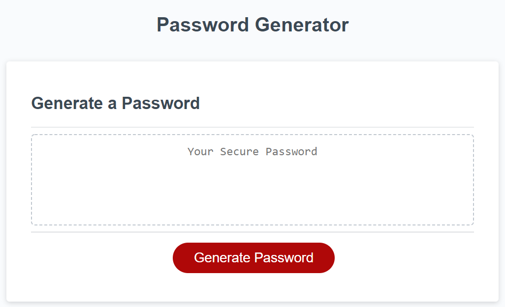

# Random Password Generator

## Table of Contents
- [Description](#description)
- [Link to Website](#website-link)
- [Github Repository](#github-repo)
- [Screenshot](#screenshot)
- [Liscense](#license)

#
#
### Description
#### This project was to learn and build Javascript functions using variables, arrays, operators, conditionals, and for-loops. It allows user to select number of characters and type of characters to generate a randomized password that the user can then copy to clipboard for use.  

#

### Link to Website: [Password Generator](https://yogibruce.github.io/Password-generator/)

### Github Repository: [portfolio-page](https://github.com/YogiBruce/Password-generator)

#
### Screenshot

#
### License [MIT](http://choosealicense.com/licenses/mit/)